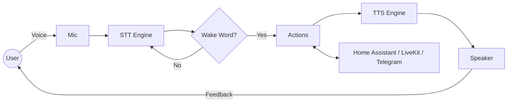

# 🎙️ LiveKit Headless Audio Client

A high-performance, headless Python client that transforms your conference speakerphone into a proactive, voice-activated smart assistant.

Optimized for **PipeWire** and fully integrated with **Home Assistant**.

---

## ⚡ Quick Start

```bash
# 1. Install system dependencies
sudo apt install libportaudio2 libttspico-utils

# 2. Setup virtual environment
python -m venv .venv
.venv/bin/pip install -e .

# 3. Setup STT models
alexa-setup

# 4. Create config
cp config.yaml.example config.yaml
# Edit config.yaml — fill in credentials under env: and customize triggers

# 5. Run it!
alexa-client --web          # browser dashboard at http://<host>:8080
```

### Configuration

All configuration lives in a single `config.yaml` file:

```yaml
env:                        # replaces .env — credentials and settings
  LIVEKIT_URL: wss://...
  LIVEKIT_API_KEY: ...

wake_words: [galileo]       # voice trigger words
command_timeout: 3.0        # seconds to listen after wake word
triggers:                   # phrase → action mappings
  - phrase: "chiama"
    actions:
      - type: livekit_join
```

**Hot-reload**: Edit and save `config.yaml` while the daemon is running — triggers, wake words, and env vars update within ~4 seconds without a restart.

**Migration from `actions.yaml` + `.env`**: `actions.yaml` still works (deprecated warning logged). To migrate, copy `actions.yaml` content into `config.yaml` and add an `env:` section with values from `.env`. See `config.yaml.example` for the full format.

---

## ✨ Key Features

- **Proactive Audio Management**: Automatically handles Bluetooth profiles (mSBC) and PipeWire routing.
- **Voice-Activated**: Built-in Wake Word detection (Vosk) with customizable `config.yaml` (hot-reloaded — no restart needed).
- **Bidirectional MQTT**: Home Assistant Discovery support. Forward voice commands to HA and trigger local actions via MQTT.
- **Web Dashboard**: Real-time browser UI (VU meters, STT status, participants, live logs, restart button) — accessible from any device on the LAN.
- **Multi-Turn Dialogue**: Interactive "Ask" actions for complex voice interactions.
- **Headless Optimized**: Low CPU usage, suitable for embedded Linux boards and single-board computers.

---

## 🏗 Architecture



---

## 📚 Documentation

Dive deeper into specific topics:

- 🛠 **[Hardware Setup](docs/setup_hardware.md)**: PipeWire, Bluetooth, and device-specific fixes.
- 🚀 **[Software Installation](docs/setup_software.md)**: Dependencies, venv, and STT models.
- ⚙️ **[Configuration](docs/configuration.md)**: Environment variables, `config.yaml`, and hot-reload.
- 🤖 **[MQTT & Home Assistant](docs/mqtt_integration.md)**: Auto-discovery and remote control.
- 🔍 **[Troubleshooting](docs/troubleshooting.md)**: Common audio, connection, and permission fixes.

---

## 🛠 Commands

| Command | Description |
|---------|-------------|
| `alexa-client` | Start the assistant daemon (headless) |
| `alexa-client --web` | Start with the web dashboard (LAN-accessible, default port 8080) |
| `alexa-client --web --web-port 9090` | Web dashboard on a custom port |
| `alexa-audio` | Run a microphone → speaker loopback test |
| `alexa-devices` | List all detected audio devices |
| `alexa-setup` | Download/Update STT models |

---

## 🧩 Project Structure

- `alexa_custom/client.py`: Main LiveKit & loop logic.
- `alexa_custom/stt.py`: Vosk speech-to-text pipeline.
- `alexa_custom/mqtt.py`: MQTT & HA Discovery.
- `alexa_custom/actions.py`: Action dispatcher & Telegram.
- `alexa_custom/audio.py`: Hardware monitoring & proactive fixes.

---

## License

Apache-2.0
