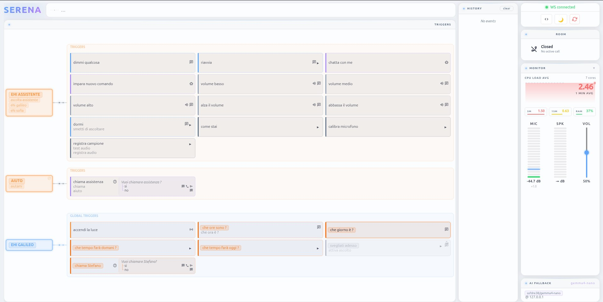

<div style="display: flex; align-items: center; justify-content: center; gap: 48px; flex-wrap: wrap;">
  <h1 style="margin: 0; font-size: 4em; font-weight: 900; letter-spacing: -2px;">🎙️ <span style="background: linear-gradient(135deg, #4ade80, #60a5fa); -webkit-background-clip: text; -webkit-text-fill-color: transparent; background-clip: text;">Serena</span></h1>
  
</div>

<p align="center">
  <em>Turn any USB speakerphone into an Italian-speaking AI assistant with an Arduino Uno Q — optional fully local, open source, zero cloud.</em>
</p>

<p align="center">
  <em>Why Serena? I wanted a voice assistant that didn't phone home. One that understood Italian naturally, ran on cheap hardware, and answered to me — not a cloud. Serena is that assistant.</em>
</p>

<p align="center">
  
  
  
  
  
  
</p>

<br>

<p align="center">
  <a href="#-features"><strong>Features</strong></a> ·
  <a href="#-quick-start"><strong>Quick Start</strong></a> ·
  <a href="#%EF%B8%8F-architecture"><strong>Architecture</strong></a> ·
  <a href="#%EF%B8%8F-web-dashboard"><strong>Dashboard</strong></a> ·
  <a href="#-configuration"><strong>Config</strong></a> ·
  <a href="details.md"><strong>Technical Reference</strong></a>
</p>

---

## 📋 Index

- [✨ Features](#-features)
- [💡 Who's It For](#-whos-it-for)
- [🎤 Voice Interaction](#-voice-interaction)
- [🚀 Quick Start](#-quick-start)
- [🏗️ Architecture](#%EF%B8%8F-architecture)
- [🖥️ Web Dashboard](#%EF%B8%8F-web-dashboard)
- [🔩 Requirements](#-requirements)
- [⚙️ Configuration](#-configuration)
- [🔒 Security](#-security)
- [🛠️ Commands](#%EF%B8%8F-commands)
- [🔧 Troubleshooting](#-troubleshooting)
- [📚 Documentation](#-documentation)
- [🗜️ Headroom](#%EF%B8%8F-headroom--context-compression-for-ai-agents)
- [🤝 Contributing](#-contributing)

---


## 💡 Who's It For

| 👴 Elderly Care | 🏠 Smart Home | 🔒 Privacy-First |
|---|---|---|
| Voice-activated emergency calls, medication reminders, and family check-ins. Wide phonetic matching works even with slurred speech. | Control lights, heating, shutters, and TV by voice. Built-in Home Assistant Discovery — no bridging required. | Everything runs on-device until the emergency protocol or request. |

---
## ✨ Features

| | |
|---|---|
| 🧠 **Single-Model STT** | One always-on free-vocabulary model transcribes continuously. Wake-word detection and command matching both run on the same transcript — no model switching, lower latency. |
| ⚡ **Smart Inline Pass-Through** | If the command follows the wake word in one breath, it's matched immediately — no second capture round-trip. Three speaking patterns for different use cases. |
| 🗣️ **Neural Italian TTS** | Piper speaks back with natural intonation. Falls back to lightweight Pico when every millisecond counts. Both run locally — zero API fees. |
| 📞 **Polite LiveKit Join** | Polls the room via REST API; only connects when a remote participant is present. Disconnects cleanly if nobody joins within the timeout. |
| 🏠 **Home Assistant Discovery** | Auto-registers as Media Player and Voice Assistant entities via MQTT. No configuration needed — just point at your broker. |
| 🤖 **LLM Chat & Learning** | Chat with a cloud LLM through voice. Say *"impara nuovo comando"* to teach new triggers interactively — no YAML editing required. |
| 🔄 **Hot-Reload Everything** | Edit config, triggers, or the dashboard HTML while the daemon runs. Changes apply in ~2 seconds — no restart. |
| 🖥️ **Real-Time Dashboard** | Live VU meters with RMS needle, STT status badges, room panel, streaming logs, and an in-browser config editor. |
| 🔌 **17+ Action Types** | Voice triggers run shell commands, publish MQTT, send Telegram alerts, control volume, query weather, and more. All wired in plain YAML. |
| 💡 **LED Matrix Feedback** | Animated icons on the built-in 8×13 display: scanning wave while listening, hourglass while thinking, checkmark on success. |


---


## 🚀 Quick Start

```bash
# 1. System dependencies (Debian 13)
sudo apt install python3-venv pipewire pulseaudio-utils alsa-utils

# 2. Python environment
python3 -m venv .venv && source .venv/bin/activate

# 3. Install Serena
pip install -e .
pip install smbus2   # optional: I2C OLED display

# 4. Download speech models (Vosk, Piper)
alexa-setup

# 5. Configure audio routing (run once)
sudo apt install task  
task audio:setup

# 6. Create configuration
mkdir -p conf/actions
cp conf.example/config.yaml conf/config.yaml
cp conf.example/secrets.yaml conf/secrets.yaml

# 7A. Install as a systemd service (recommended for headless use)
task setup
sudo loginctl enable-linger $(whoami)
systemctl --user start serena

# 7B.  or start the assistant directly
alexa-client
```

Open **http://localhost:8080** for the web dashboard.

> 💡 New to the project? See [details.md](details.md) for the full installation guide, including systemd setup, audio troubleshooting, and configuration reference.

### Audio diagnostics

```bash
alexa-devices       # list audio input/output devices
alexa-audio         # microphone → speaker loopback test
alexa-audio-doctor  # full audio diagnostics
task audio:status   # audio device health dashboard
```

---

## 🏗️ Architecture

```
┌────────────────────────────────────────────────────────────────────────┐
│                        🎙️  AUDIO CAPTURE LAYER                        │
│                                                                        │
│   [🎙️ USB Mic (NewPie)] ───► ALSA/PipeWire Sound Daemon                 │
│                                │                                       │
│          ┌─────────────────────┴─────────────────────┐                 │
│          ▼                                           ▼                 │
│   [Legacy Backend]                            [Modern Backend]         │
│   "parec" subprocess                          "gstreamer" pipeline     │
│          │                                           │                 │
│          │ (Raw s16le PCM)                           │ (pulsesrc/pw)   │
│          │                                           ▼                 │
│          │                                    ┌──────────────┐         │
│          │                                    │  webrtcdsp   │ (C++ NS │
│          │                                    │  Noise & AGC │  & AGC) │
│          │                                    └──────┬───────┘         │
│          │                                           ▼                 │
│          │                                    ┌──────────────┐         │
│          │                                    │ audiodynamic │ (C++    │
│          │                                    │  Compressor  │  Comp)  │
│          │                                    └──────┬───────┘         │
│          │                                           │                 │
│          ▼                                           ▼                 │
│   ┌──────────────────────────────────────────────────────────────┐     │
│   │                 📬  Non-blocking OS Pipe (stdout)             │     │
│   └──────────────────────────────┬───────────────────────────────┘     │
└──────────────────────────────────┼─────────────────────────────────────┘
                                   │ Raw 16kHz s16le Mono
                                   ▼
┌────────────────────────────────────────────────────────────────────────┐
│                        🧠  STT PIPELINE LAYER                          │
│                                                                        │
│          ┌───────────────────────────────────────────┐                 │
│          │  VAD Gate (RMS Energy & Silence Filter)   │                 │
│          └─────────────────────┬─────────────────────┘                 │
│                                │                                       │
│                                ▼                                       │
│          ┌───────────────────────────────────────────┐                 │
│          │  Vosk / sherpa-onnx Single Always-On Model│                 │
│          └─────────────────────┬─────────────────────┘                 │
└──────────────────────────────────┼─────────────────────────────────────┘
                                   │ 📝 Live Text Transcript
                                   ▼
┌────────────────────────────────────────────────────────────────────────┐
│                        🎯  TRIGGER MATCHING LAYER                      │
│                                                                        │
│          ┌───────────────────────────────────────────┐                 │
│          │ Italian Phonetic Normalization (graphemes)│                 │
│          └─────────────────────┬─────────────────────┘                 │
│                                │                                       │
│                                ▼                                       │
│          ┌───────────────────────────────────────────┐                 │
│          │   Fuzzy String Distance Match (RapidFuzz)  │                 │
│          └─────────────────────┬─────────────────────┘                 │
└──────────────────────────────────┼─────────────────────────────────────┘
                                   │ ⚡ Intent Match
                                   ▼
┌────────────────────────────────────────────────────────────────────────┐
│                        ⚙️  ACTION DISPATCH LAYER                       │
│                                                                        │
│   ┌───────────────┐ ┌───────────────┐ ┌───────────────┐ ┌───────────┐  │
│   │ 🐚 Shell      │ │ 📡 MQTT      │ │ 📞 LiveKit    │ │ 🤖 LLM    │  │
│   │   Command     │ │   Publish     │ │   Room Join   │ │   Chat    │  │
│   └──────┬────────┘ └───────┬───────┘ └───────┬───────┘ └─────┬─────┘  │
│          │                  │                 │               │        │
│          └──────────────────┴────────┬────────┴───────────────┘        │
│                                      ▼                                 │
└────────────────────────────────────────────────────────────────────────┘
                                       │
                                       ▼ Output Response
┌────────────────────────────────────────────────────────────────────────┐
│                        🗣️  TTS & WEB INTERFACE                         │
│                                                                        │
│          ┌───────────────────────────────────────────┐                 │
│          │     Piper / Pico Neural TTS Synthesizer   │                 │
│          └─────────────────────┬─────────────────────┘                 │
│                                │                                       │
│                                ▼                                       │
│          ┌───────────────────────────────────────────┐                 │
│          │        🔊 Playback via pw-play client     │                 │
│          └───────────────────────────────────────────┘                 │
│                                                                        │
│   🖥️  aiohttp Web Dashboard ◄───[WebSockets]───► Client Daemon          │
└────────────────────────────────────────────────────────────────────────┘
```

Serena is built in five layers:

1. **Audio Pipeline** — Captures raw 16 kHz s16le audio from the USB microphone using either a standard `parec` subprocess or a high-performance **GStreamer pipeline** (`pulsesrc`/`pipewiresrc` + `webrtcdsp`). The GStreamer backend performs hardware-accelerated noise suppression, high-pass filtering, automatic gain control (AGC), and dynamic range compression (`audiodynamic`) natively in C++ before sending audio to the STT pipeline. A VAD gate filters audio during TTS playback to prevent echo loops.
2. **STT Pipeline** — Runs a single always-on free-vocabulary Vosk or sherpa-onnx transcription model that continuously transcribes the captured audio stream. Wake detection and command recognition both happen by matching this single model's live output.
3. **Trigger Matching** — The transcript is matched against YAML-defined triggers using Italian phonetic normalization + fuzzy matching (RapidFuzz). Supports glob patterns, direct matches, and scoped wake-word groups.
4. **Action Dispatch** — Matched triggers invoke registered handlers: TTS, MQTT, LiveKit, Telegram, shell, LLM chat, volume control, weather, and more.
5. **Web & Integration** — aiohttp dashboard serves real-time status and hot-reloads configuration. MQTT publishes Home Assistant auto-discovery. LiveKit client manages JWT tokens and bidirectional audio.

---

## 🖥️ Web Dashboard

Serena includes a real-time browser dashboard at `http://&lt;host&gt;:8080`:

- **STT status** — live wake-word detection with an animated wave indicator
- **VU meters** — real-time input/output levels with RMS needle
- **Room panel** — LiveKit call status with countdown timer and participant list
- **Live logs** — streaming log output with clear button
- **Configuration panel** — edit wake words, STT/TTS backends, audio levels, and recognition thresholds without SSH
- **Dark/light theme** — follows your system preference, toggleable per session

<p align="center">
  
</p>

---

## 🔩 Requirements

| Hardware | Software |
|---|---|
| Linux board (aarch64, 2+ GB RAM) | Debian 13 (Trixie) or similar |
| USB speakerphone (e.g., NewPie) | PipeWire 1.4+ with PulseAudio compat |
| Optional: LED matrix or I2C OLED display | Python 3.13+ |

Optimized for the **Arduino Uno Q** (Qualcomm Snapdragon 801), but runs on any Linux system with PipeWire.

---

## ⚙️ Configuration

Configuration lives in `conf/` with hot-reload support:

| File | Purpose | Reload |
|---|---|---|
| `conf/config.yaml` | Wake words, audio, STT, TTS, LLM, MQTT, display | ~2 seconds |
| `conf/secrets.yaml` | Credentials (git-ignored) | Restart required |
| `conf/actions/*.yaml` | Voice triggers and startup actions | ~2 seconds |

```yaml
wake_words:
  - "ehi serena"

recognition:
  wake_window: 8.0
  matching_threshold: 75.0

stt:
  backend: vosk
  vad_silence_ms: 900

triggers:
  - commands: ["che ore sono"]
    actions:
      - type: shell
        command: date +%H:%M
  - commands: ["accendi la luce"]
    actions:
      - type: mqtt_publish
        topic: home/light/set
        payload: "ON"
```

### Key environment variables

| Variable | Description |
|---|---|---|
| `LIVEKIT_URL` / `LIVEKIT_API_KEY` / `LIVEKIT_API_SECRET` / `LIVEKIT_ROOM` | LiveKit connection (required for calls) |
| `TELEGRAM_BOT_TOKEN` / `TELEGRAM_CHAT_ID` | Telegram notifications |
| `LLM_HOST` / `LLM_API_KEY` | OpenAI-compatible LLM endpoint |
| `LOG_LEVEL` | Python log level (default: `INFO`) |

---

## 🎤 Voice Interaction

> **User:** *Galileo, che ore sono?*
>
> **Serena:** *Sono le 15 e 42.*
>
> **User:** *Galileo, impara nuovo comando*
>
> **Serena:** *OK, dimmi la frase da imparare.*
>
> **User:** *"apri cancello"*
>
> **Serena:** *Frase registrata. Ora dimmi cosa deve fare.*
>
> **User:** *mqtt publish a "home/gate/set" con payload "ON"*
>
> **Serena:** *Comando "apri cancello" imparato. Puoi usarlo subito.*

---

## 🔒 Security

- `conf/secrets.yaml` is **git-ignored** by default. Verify with `git check-ignore conf/secrets.yaml`.
- Set restrictive permissions: `chmod 600 conf/secrets.yaml`.
- Credentials are also read from environment variables (`LIVEKIT_URL`, `LIVEKIT_API_KEY`, `TELEGRAM_BOT_TOKEN`, etc.) — preferred for containerized deployments.
- The web dashboard binds to `0.0.0.0:8080` by default. Restrict with `--web-host 127.0.0.1` in production.

---

## 🛠️ Commands

| Command | Description |
|---|---|
| `alexa-client --web-port 8080` | Start with dashboard on custom port |
| `alexa-client --web-host 127.0.0.1` | Restrict dashboard to localhost |
| `alexa-setup` | Download/update STT and TTS models |
| `alexa-devices` | List detected audio devices |
| `alexa-audio` | Microphone → speaker loopback test |
| `alexa-audio-doctor` | Full audio diagnostics |
| `alexa-record --duration 5` | Record and transcribe audio |

---

## 🔧 Troubleshooting

| Symptom | Fix |
|---|---|
| No audio after boot | `amixer -c 0 sset PCM 100%` — PCM mixer resets on PipeWire init |
| Audio drops mid-session | `task audio:restart` — restores routing and PCM |
| Microphone not detected | `alexa-devices` to list cards; check `wpctl status` |
| LiveKit join hangs | Verify `wait_for_participant` and `answer_timeout` in config |
| Service won't start | `journalctl --user -fu serena` — check logs |

---

## 📦 Dependencies

| Package | Purpose |
|---|---|
| `livekit` / `livekit-api` | LiveKit room client and REST API |
| `sounddevice` | Device enumeration only |
| `numpy` | Audio signal processing |
| `pulsectl` | PipeWire/PulseAudio routing |
| `vosk` | Local wake-word + STT |
| `piper-tts` | Local text-to-speech |
| `aiomqtt` | MQTT / Home Assistant |
| `aiohttp` | Web dashboard server |
| `httpx` | HTTP client for LLM/Ollama |
| `rapidfuzz` | Fuzzy phonetic matching |
| `ruamel.yaml` | YAML round-trip editing |
| `openai` | OpenAI-compatible LLM backend |
| `pyyaml` | Base YAML loading |
| `smbus2` | I2C OLED display (optional) |

---

## 📚 Documentation

| Guide | What's inside |
|---|---|
| [→ Technical Reference](details.md) | Full architecture, config reference, CLI, audio pipeline, STT, actions, displays, MQTT, development, troubleshooting |
| [→ Bill of Materials](docs/BOM.md) | Hardware add-ons with prices, links, and running total |
| [→ Hardware Setup](docs/setup_hardware.md) | PipeWire configuration, Bluetooth, board-specific fixes |
| [→ Software Installation](docs/setup_software.md) | Dependencies, virtual environment, model downloads |
| [→ Configuration Reference](docs/configuration.md) | Every config field documented |
| [→ Audio Architecture](docs/audio.md) | Capture and playback paths, known bugs and workarounds |
| [→ STT Pipeline](docs/stt.md) | Two-stage detection, Italian phonetics, trigger matching |
| [→ MQTT & HA](docs/mqtt_integration.md) | Home Assistant auto-discovery, entities, bidirectional control |
| [→ Displays](docs/display_setup.md) | LED matrix, I2C OLED, GPIO LED configuration |
| [→ Troubleshooting](docs/troubleshooting.md) | Common issues: audio, connection, permissions |

---

## 🗜️ Headroom — Context Compression for AI Agents

[Headroom](https://github.com/chopratejas/headroom) is installed as an MCP server so Claude Code and Gemini CLI can compress tool outputs, logs, and conversation history before they reach the model — reducing token usage by 60–95% on large contexts.

### MCP server

The server is registered in `.claude/settings.json` (Claude Code) and `~/.gemini/settings.json` (Gemini CLI):

```json
{
  "mcpServers": {
    "headroom": {
      "command": "headroom",
      "args": ["mcp", "serve"]
    }
  }
}
```

Both tools expose three MCP tools automatically: `headroom_compress`, `headroom_retrieve`, and `headroom_stats`.

### Using headroom in Python

```python
from headroom import compress

# Compress a large log or tool output before sending to a model
compressed = compress(log_text)
```

### CLI proxy (zero-code integration)

Run headroom as a drop-in proxy in front of any OpenAI-compatible endpoint:

```bash
headroom proxy --port 8787
# Then point your LLM_HOST to http://localhost:8787
```

### Installation

```bash
pip install "headroom-ai[mcp,proxy]"
```

> Requires Python ≤ 3.13 for source builds. On Python 3.14+ use `--only-binary headroom-ai`.

---

## 🤝 Contributing

Contributions welcome! Open an issue first for significant changes.

```bash
source .venv/bin/activate
task test          # run regression tests
task lint          # ruff check + format check
task fix           # auto-fix, format, and test
```

---

<p align="center">
  <a href="LICENSE"></a>
</p>
<p align="center">
  Made by Galileo Team for privacy-first voice assistants
</p>
