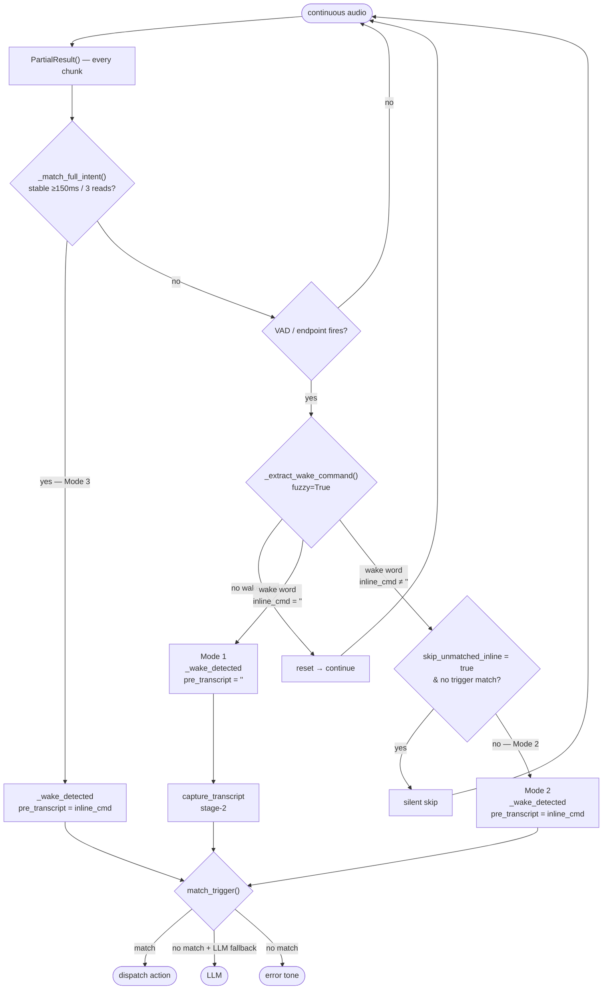

# STT Recognition Modes and Wake Behaviour

alexa-custom supports three speech interaction patterns in two-stage mode.

---

## Overview



---

## Mode 1 — wake word → beep → command

The user speaks the wake word, pauses, waits for the beep, then speaks the command as a separate utterance.

```
[user: "arduino"]  →  stage-1 fires  →  beep plays  →  [user: "chiama stefano"]  →  stage-2 captures
```

### Flow

1. **Stage-1** runs continuously. Vosk (free-vocabulary) accumulates audio chunks.
   - The software VAD fires when `stage1.vad_silence_ms` of silence is detected after
     at least `stage1.min_speech_ms` of speech.
   - Alternatively, Vosk's internal endpoint detector fires first — whichever comes first.
2. `_extract_wake_command()` checks if the transcript matches a wake word. On match, `inline_cmd` is empty.
3. The wake beep plays (`pw-play`), blocking until done.
4. **Stage-2** (`capture_transcript`) starts:
   - `_drain_pipe()` flushes all audio that accumulated in the pipe during the beep.
   - An additional `flush_ms` (hardcoded 300 ms) of fresh audio is discarded to let
     speaker echo and reverberation decay.
   - Vosk listens until `stt.vad_silence_ms` of silence or `command_timeout` expires.
   - The final transcript is matched against triggers.

### Tuning

| Parameter | Location | Effect |
|-----------|----------|--------|
| `stage1.vad_silence_ms` | `conf/config.yaml` `stt.stage1` | How long after the wake word before stage-1 fires. Lower = snappier; the user can start speaking sooner. |
| `stage1.min_speech_ms` | `conf/config.yaml` `stt.stage1` | Minimum speech before the VAD timer starts. Prevents noise from triggering early finalization. |
| `stt.vad_silence_ms` | `conf/config.yaml` `stt` | Silence that ends the command window in stage-2. Lower = snappier end detection; raise if commands get cut off mid-sentence. |
| `recognition.command_timeout` | `conf/config.yaml` `recognition` | Hard deadline for stage-2 capture in seconds. |
| `flush_ms` | hardcoded 300 ms in `stt.py:_wake_detected` | Audio discarded after the beep to absorb echo. Reducing this can help if the user speaks immediately after the beep, but risks picking up speaker echo. |

---

## Mode 2 — one breath (wake word + command, no pause)

The user speaks wake word and command in a single continuous utterance without waiting for the beep.

```
[user: "arduino chiama stefano"]  →  stage-1 fires  →  inline_cmd extracted  →  beep plays  →  stage-2 skipped
```

### Flow

1. **Stage-1** accumulates audio as in mode 1.
   - The VAD window (`stage1.vad_silence_ms`) must remain open long enough to capture
     the entire phrase including the command words.
2. `_extract_wake_command()` strips the wake word from the transcript and returns the
   remainder as `inline_cmd` (e.g. `"chiama stefano"`).
3. `_wake_detected` is called with `pre_transcript=inline_cmd` — it **skips**
   `capture_transcript` entirely and goes straight to trigger matching.
4. The beep plays after the match, so the user hears confirmation but does not need
   to speak again.

### Why it can fail

If the user makes any pause between the wake word and the command that exceeds
`stage1.vad_silence_ms`, stage-1 fires on the wake word alone (`inline_cmd=""`).
The daemon then plays the beep and calls `capture_transcript`, which calls
`_drain_pipe()` — **throwing away any command words already spoken**. The user must
repeat the command after the beep (falling back to mode 1).

The default `stage1.vad_silence_ms` is 900 ms (as configured in `conf/config.yaml`),
which bridges most natural micro-pauses after the wake word.

### Tuning

| Parameter | Location | Effect |
|-----------|----------|--------|
| `stage1.vad_silence_ms` | `conf/config.yaml` `stt.stage1` | **Primary knob for mode 2.** Must be wider than the longest pause the user makes between wake word and command. Raise if mode 2 keeps falling back to mode 1; lower if mode 1 latency is too high. |
| `stage1.min_speech_ms` | `conf/config.yaml` `stt.stage1` | Minimum speech before the VAD timer starts. Prevents the VAD from triggering on a brief syllable. |
| `skip_unmatched_inline` | `conf/config.yaml` `wake_words[*]` | Per-group. If `true`, silently ignore when stage-1 fires with an inline command that matches no trigger (no beep, no stage-2, no LLM). Wake-only detection (mode 1) is unaffected. |

---

## Mode 3 — streaming intent (wake word + command, no silence wait)

The system fires the moment a complete (wake word + trigger phrase) combination is stably recognised in the Vosk partial transcript — before any VAD silence occurs.

```
[user: "arduino chiama stefano"]  →  partial stable for 150ms  →  fires immediately  →  beep plays  →  stage-2 skipped
```

### Flow

1. **Stage-1** runs continuously. On every audio chunk Vosk emits a partial transcript.
2. `_match_full_intent()` checks if the partial exactly matches any `(wake phrase + trigger phrase)` combo from the pre-built `intent_map`. Exact matching only — fuzzy is never applied to partials.
3. When the same full-intent match appears for at least `partial_stability_reads` consecutive reads AND `partial_stability_ms` of wall-clock time, `_wake_detected` is called immediately with `pre_transcript=inline_cmd`.
4. Stage-2 is skipped (same as mode 2). The beep plays as confirmation.
5. If no intent match is found (wake only, or unknown command), the loop falls through to the existing VAD path — modes 1, 2, and LLM fallback all work unchanged.

### When mode 3 fires vs. falls back

```
partial matches (wake + known trigger)?
        YES → stable for 150ms / 3 reads? → FIRE immediately (mode 3)
        NO  → VAD fires on finalized transcript
                 ├─ wake only        → beep + stage-2 capture (mode 1)
                 ├─ wake + inline    → inline_cmd extracted (mode 2)
                 └─ wake + unknown   → LLM fallback
```

### Why it can fail

If the Vosk partial never stabilises at exactly the full phrase (e.g. the user's accent causes consistent mistranscription of a wake word alias), mode 3 silently falls back to mode 1/2. Adding the mistranscribed form as an alias in `config.yaml` is the fix — fuzzy matching is intentionally not used on partials.

### Tuning

| Parameter | Location | Effect |
|-----------|----------|--------|
| `recognition.partial_matching` | `conf/config.yaml` | Enable/disable mode 3 (default `true`). |
| `recognition.partial_stability_ms` | `conf/config.yaml` | Minimum wall-clock ms the partial match must be stable before firing (default 150ms). Lower = faster response; raise if false fires occur. |
| `recognition.partial_stability_reads` | `conf/config.yaml` | Minimum consecutive matching partial reads (default 3). Protects against single-frame Vosk flickers. |

---

## Comparison

| | Mode 1 | Mode 2 | Mode 3 |
|-|--------|--------|--------|
| Speaking pattern | Wake word → pause → beep → command | Wake word + command in one breath | Wake word + command in one breath |
| Trigger | VAD silence / Vosk endpoint | VAD silence / Vosk endpoint | Partial transcript stability |
| Beep timing | Before command | After command | After command |
| Stage-2 capture | Yes — full `capture_transcript` | No — `inline_cmd` from stage-1 | No — `inline_cmd` from partial match |
| Latency after last word | `stage1.vad_silence_ms` (500–900ms) | `stage1.vad_silence_ms` (500–900ms) | `partial_stability_ms` (≈150ms) |
| Requires known trigger phrase | No | No (opt-in via `skip_unmatched_inline`) | Yes — always |
| Fuzzy matching | No (exact + alias) | Yes (`_approx_wake_match` on final) | No (exact only on partials) |
| Sensitivity to `stage1.vad_silence_ms` | Low | High — must exceed pause between wake word and command | None |
| Risk of losing command audio | None | Yes, if pause > `stage1.vad_silence_ms` | None |
| LLM fallback for unknown commands | Yes | Yes (unless `skip_unmatched_inline`) | Falls back to mode 1/2 + LLM |

---

## Current configuration

```yaml
wake_words:
  - word: "ehi galileo"
    # skip_unmatched_inline: false   # set true to ignore unrecognised inline commands

stt:
  vad_silence_ms: 500      # stage-2 command-end silence (mode 1)

  stage1:
    backend: vosk
    vad_silence_ms: 900    # bridges wake word + command pause (mode 2)
    min_speech_ms: 300

recognition:
  command_timeout: 2.5
  partial_matching: true        # mode 3 enabled by default
  partial_stability_ms: 150     # min ms before firing on stable partial match
  partial_stability_reads: 3    # min consecutive matching reads
```

`recognition.command_timeout: 2.5` (in `conf/config.yaml` under `recognition`).
